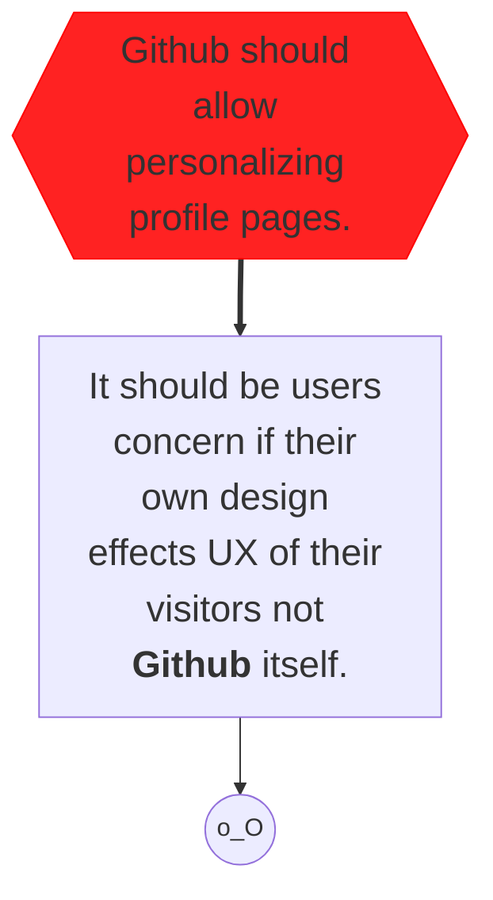

```mermaid
%%{
  init: {
    'theme': 'base',
    'securityLevel' :'loose',
    'secure' : ["securityLevel"],
    }
  }
}%%

flowchart TD
  A{{Github should allow personalizing profile pages.}}
  B["`It should be users concern if their own design effects UX of their visitors not **Github** itself.`"]
  C(("o_O"))
  A:::aClass==>B:::bClass-->C
  classDef aClass stroke:#f00,fill:#f22,font-size:18pt;
  classDef bClass font-size:18pt;
  style C background:#fff
```
