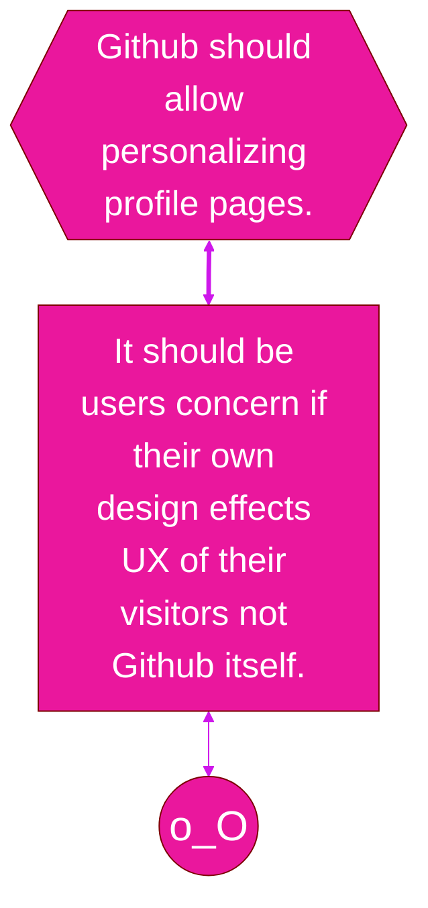

```mermaid
%%{
  init: {
    'theme': 'base',
    'themeVariables': {
      'primaryColor': '#ea179d',
      'primaryTextColor': '#fff',
      'primaryBorderColor': '#7C0000',
      'lineColor': '#ce17ea',
      'secondaryColor': '#006100',
      'tertiaryColor': '#fff',
      'fontSize':'20pt'
    }
  }
}%%

flowchart TD
  A{{Github should allow personalizing profile pages.}}
  B[It should be users concern if their own design effects UX of their visitors not Github itself.]
  C(("o_O"))
  A<==>B<-->C:::cClass
  classDef cClass font-size:24pt;
```
